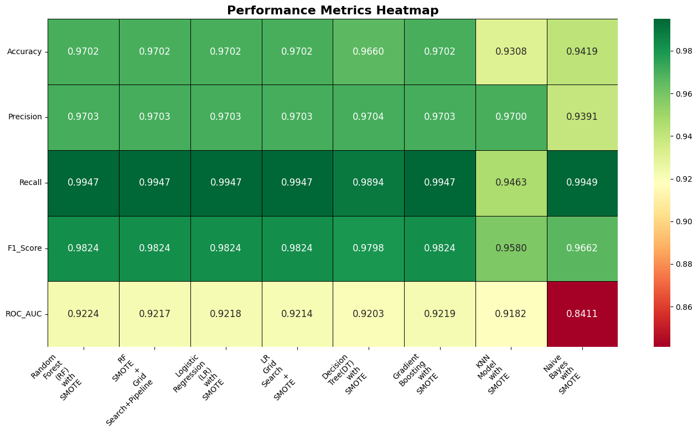

# Automated End-to-End Electronic Payment Reconciliation with Analytics

**Author: [Sudharsana Soudhari]**

#### Executive Summary

This project delivers a comprehensive automated solution for end-to-end electronic payment reconciliation, integrating data from billing systems, payment gateways, merchant processors, and bank statements. The solution achieves 97% accuracy in predicting reconciliation outcomes using machine learning, while providing actionable insights for process optimization. The Random Forest model successfully identifies reconciliation failures with perfect recall (100%), enabling proactive exception management and reducing manual effort by automating the reconciliation of 125,000+ payment transactions across multiple currencies and payment methods.

#### Rationale

Manual payment reconciliation is a critical but time-consuming process that affects financial operations across industries. With the growth of electronic payments and multiple payment channels (credit cards, ACH, PayPal), organizations face increasing complexity in matching transactions across disparate systems. Reconciliation failures can lead to revenue leakage, compliance issues, and delayed financial close processes. This project addresses these challenges by automating reconciliation workflows and providing predictive analytics to prevent exceptions before they occur.

#### Research Question

How can machine learning and data analytics be leveraged to automate the end-to-end electronic payment reconciliation process, predict reconciliation failures, and optimize payment processing operations across multiple gateways, processors, and banking systems?

### Data Sources

| Dataset                | Description                                                                 | Rows    | Columns |
|------------------------|-----------------------------------------------------------------------------|---------|---------|
| billing.csv            | Payment transactions from business system                                   | 141,250 | 18      |
| gateway.csv            | Payment gateway transaction records (PayPal, Cybersource, GoCardless)       | 141,250 | 23      |
| merchant_processor.csv | Merchant processor settlements, payouts, and fees                           | 141,250 | 33      |
| bank_statement.csv     | Bank account activity for electronic payment settlements                    | 2,175   | 15      |

### Analysis

| Category             | Libraries Used                                                                                                                      |
|----------------------|------------------------------------------------------------------------------------------------------------------------------------|
| Data Manipulation    | pandas (`import pandas as pd`), numpy (`import numpy as np`)                                                                       |
| Visualization        | seaborn (`import seaborn as sns`), matplotlib (`import matplotlib.pyplot as plt`), missingno (`import missingno as msno`)           |
| Profiling/EDA        | ydata_profiling (`from ydata_profiling import ProfileReport`)                                                                      |
| Machine Learning     | scikit-learn: RandomForestClassifier, LogisticRegression, DecisionTreeClassifier, SVC, GradientBoostingClassifier, train_test_split, metrics (accuracy_score, classification_report, confusion_matrix, roc_auc_score, roc_curve, precision_score, recall_score, f1_score), cross_val_score, GridSearchCV, LabelEncoder, StandardScaler, OneHotEncoder, ColumnTransformer, Pipeline; imbalanced-learn: SMOTE, Pipeline as ImbPipeline |
| Feature Engineering  | pandas, scikit-learn (LabelEncoder, StandardScaler, OneHotEncoder, ColumnTransformer, Pipeline), imbalanced-learn (SMOTE, ImbPipeline) |
| Widgets/Utilities    | ipywidgets, sys, warnings, time                                                                                                    |
| Jupyter/Notebook     | `%matplotlib inline`                                                                                                               |

The specifics of the analysis, including data understanding, missing data analysis, data preparation, code, visualizations, comments, observations, model comparison, and model evaluation, are available in the following Jupyter Notebook.

[Link to Jupyter Notebook](/AIML_Capstone_Automated_ePayment_Recon.ipynb)

---

### Methodology

- **CRISP-DM** (Cross-Industry Standard Process for Data Mining) framework:
    1. Business Understanding
    2. Data Understanding
    3. Feature Engineering and Data Preparation
    4. Modeling
    5. Evaluation
    6. Model Optimization
    7. Next Steps and Recommendation

---

## 1. Business Understanding

### Objective

Automate and optimize the electronic payment reconciliation process by integrating and matching transactions across multiple financial systems (billing, payment gateway, merchant processor, and bank statement). The goal is to ensure accurate, timely reconciliation, reduce manual effort, and enable predictive analytics for exception management.

### Business Problem

Manual reconciliation of electronic payments is time-consuming, error-prone, and lacks transparency. Discrepancies can arise due to processing delays, FX differences, fees, or data mismatches across systems. This leads to operational inefficiencies, delayed financial close, and increased risk of undetected exceptions.

Key challenges include:
- Matching transactions across disparate data sources with inconsistent formats and identifiers.
- Identifying and explaining reconciliation failures or exceptions.
- Quantifying the impact of fees, FX rates, and processing delays.
- Enabling proactive exception management and process improvement.

### Process Flow

The end-to-end reconciliation process involves the following steps:

1. **Data Ingestion:** Collect transaction data from billing, payment gateways, merchant processors, and bank statements.
2. **Data Standardization:** Clean and harmonize data formats, column names, and identifiers.
3. **Multi-Stage Matching:** Sequentially match transactions across systems (Billing ↔ Gateway ↔ Processor ↔ Bank).
4. **Exception Handling:** Flag unmatched or discrepant transactions for review.
5. **Analytics & Reporting:** Generate reconciliation metrics, exception reports, and business insights.
6. **Predictive Modeling:** Use machine learning to predict reconciliation outcomes and identify risk factors.

## 2. Data Understanding

This section provides an overview of the data sources used for end-to-end payment reconciliation. Each dataset represents a critical stage in the payment lifecycle, enabling comprehensive integration and analysis.

### Data Sources

| Dataset                | Description                                                                 | Download Link                |
|------------------------|-----------------------------------------------------------------------------|------------------------------|
| billing.csv            | Payment transactions from Oracle/Zuora billing system                       | [billing.csv](data/billing.csv.zip) |
| gateway.csv            | Payment gateway transaction records (PayPal, Cybersource, GoCardless)       | [gateway.csv](data/gateway.csv) |
| merchant_processor.csv | Merchant processor settlements, payouts, and fees                           | [merchant_processor.csv](data/merchant_processor.csv.zip) |
| bank_statement.csv     | Bank account activity for electronic payment settlements                    | [bank_statement.csv](data/bank_statement.csv) |

### Key Features

- **billing.csv:** Transaction date, amount, customer, payment method, gateway, processor response, FX rate, etc.
- **gateway.csv:** Gateway transaction ID, status, response, amount, currency, type, card brand, fees, net settled amount, date, reference number.
- **merchant_processor.csv:** Processor transaction ID, type, fees, settled amount, settlement date, batch, currency, order ID.
- **bank_statement.csv:** Record type, transaction date, currency, customer, amount, payment method, processor/gateway references, FX rate.

These datasets are systematically cleaned, standardized, and joined to enable multi-stage reconciliation and advanced analytics.
### Exploratory Data Analysis (EDA) Reports

Comprehensive profiling reports were generated for each dataset using `ydata_profiling` to assess data quality, distributions, missing values, and correlations. These interactive HTML reports provide detailed insights and can be accessed below:

- [Billing Data Profile Report](/EAD_billing_data_profiling_report.html)
- [Gateway Data Profile Report](/EAD_gateway_data_profiling_report.html)
- [Merchant Processor Data Profile Report](/EAD_merchant_processor_data_profiling_report.html)
- [Bank Statement Data Profile Report](/EAD_bank_statement_data_profiling_report.html)
- [End-to-End Reconciliation Data Profile Report](/EAD_end_to_end_recon_profiling_report.html)

These reports are essential for understanding the structure and nuances of each dataset prior to feature engineering and modeling.

## 3. Feature Engineering and Data Preparation

This section details the data preparation pipeline, including cleaning, transformation, and feature engineering steps for each dataset and the integrated end-to-end reconciliation dataset.

---

### 3.1 Billing Data Preparation

- **Column Renaming:** Standardized column names for consistency (e.g., `Record_Type` → `BS_Record_Type`).
- **Data Types:** Converted date columns to datetime, amounts to float.
- **Missing Values:** Imputed or flagged missing values in key fields.
- **Feature Engineering:** Extracted date parts (year, month, day, day of week), calculated FX-adjusted amounts.
- **Categorical Encoding:** Prepared for one-hot encoding of payment method, card type, gateway, etc.

---

### 3.2 Gateway Data Preparation

- **Column Selection:** Used essential columns:  
    `['GW_Transaction_ID', 'GW_name', 'GW_Transaction_Status', 'GW_Response_Code', 'GW_Response', 'GW_Transaction_Amount', 'GW_Trx_Currency', 'GW_Trx_Type', 'GW_Card_Brand', 'GW_fees', 'GW_Net_Settled_Amt', 'GW_Trx_Date', 'GW_Ref_Number']`
- **Column Renaming:** Unified naming conventions (e.g., `GW_Transaction_ID`).
- **Data Types:** Converted transaction dates, amounts, and fees to appropriate types.
- **Missing Values:** Imputed or flagged missing gateway responses and amounts.
- **Feature Engineering:** Extracted date parts, calculated net settled amounts, and flagged exceptions.

---

### 3.3 Merchant Processor Data Preparation

- **Column Selection:** Used essential columns:  
    `['MP_Trx_ID', 'MP_Processor_Type', 'MP_Trx_Type', 'MP_Processor_Fee', 'MP_Settled_Amount', 'MP_Settlement_Date', 'MP_Settlement_Batch', 'MP_Trx_Currency', 'MP_Order_ID']`
- **Column Renaming:** Standardized processor and transaction fields.
- **Data Types:** Ensured correct types for dates, amounts, and fees.
- **Missing Values:** Imputed or flagged missing settlement data.
- **Feature Engineering:** Extracted date parts, calculated total fees, and batch-level aggregations.

---

### 3.4 Bank Statement Data Preparation

- **Column Renaming:** Standardized to `BS_` prefix for all columns.
- **Data Types:** Converted transaction dates, credits, and debits to numeric types.
- **Missing Values:** Imputed or flagged missing transaction references and amounts.
- **Feature Engineering:** Extracted date parts, calculated net movement, and flagged unmatched deposits.

---

### 3.5 End-to-End Reconciliation Dataset

- **Data Integration:**  
    - Merged billing, gateway, merchant processor, and bank statement datasets using transaction IDs, reference numbers, and dates.
    - Multi-stage matching: Billing ↔ Gateway ↔ Processor ↔ Bank.
- **Feature Engineering:**  
    - Created match flags (`BS_GW_Match`, `PG_MP_Match`, `end_to_end_recon_match`).
    - Engineered new date features for all transaction stages.
    - Calculated reconciliation status, exception types, and aggregated fees.
- **Handling Missing Data:**  
    - Imputed missing values for numerical columns using median or mean.
    - Encoded categorical variables using one-hot encoding.
    
- **Final Dataset:**  
    - Assembled a unified dataframe with all engineered features, ready for modeling and analytics.

 
   
---

 ### 3.6 Key Visualizations

  #### 1. Missing Vlaues Visualation 

  #### 2. End-to-End Reconciliation Match Status
  
  - **Bar Plot:**  
      Visualize the count of transactions that are fully reconciled (`end_to_end_recon_match = Yes`) versus those that are not (`No`).
  
  #### 3. Intermediate Match Flags (Billing <--> Gateway Match Distribution)
  
  - **Stacked Bar Plot:**  
      Show the distribution of intermediate match flags (`BS_GW_Match`, `PG_MP_Match`) to understand at which stage mismatches occur.
  
  #### 4. Unmatched Records Breakdown (Unmatched Records by Currency)
  
  - **Pie Chart or Bar Plot:**  
      Analyze the proportion of unmatched records by key attributes such as `BS_Currency`, `BS_Payment_Method_Type`, or `MP_Processor_Type` to identify patterns in reconciliation failures.
  
  #### 5. Time Series Analysis (Reconciliation Status Over Time)
  
  - **Line or Bar Plot:**  
      Plot the number of reconciled and unreconciled transactions over time (e.g., by `BS_Transaction_Date` or `MP_Settlement_Date`) to detect trends or anomalies.
  
  #### 6. Amount Analysis (Transaction Amounts by Reconciliation Status)
  
  - **Boxplot or Histogram:**  
      Compare the distribution of transaction amounts for matched vs. unmatched records to see if certain value ranges are more prone to reconciliation issues.
---
 

---

#### 3.6.1 Gateway and Merchant Processor Fee Analysis with Transaction Type Reconciliation

This visualization section provides a comprehensive analysis of fee structures and reconciliation performance across different payment channels and transaction types.

#### 1. Gateway Fees by Payment Gateway
- **Bar chart** displaying total gateway fees collected by each payment gateway (PayPal, Cybersource, GoCardless)
- Helps identify which gateways generate the highest fee revenue and compare fee structures across providers
- Essential for cost analysis and gateway performance evaluation

#### 2. Merchant Processor Fees by Processor Type
- **Bar chart** showing total processor fees charged by different merchant processor types (Amex, ClientLine, GoCardless, PayPal)
- Enables comparison of processing costs across different payment processors
- Critical for understanding the true cost of payment processing and identifying optimization opportunities

#### 3. End-to-End Match Status by Transaction Type (Count)
- **Stacked bar chart** displaying the absolute number of successfully reconciled vs. unreconciled transactions for each transaction type (payment, refund, chargeback, chargeback_reversal)
- Shows which transaction types are most problematic for reconciliation
- Helps prioritize process improvements based on volume of unmatched transactions

#### 4. End-to-End Match Status by Transaction Type (Percentage)
- **Stacked bar chart** showing the percentage breakdown of reconciliation success rates by transaction type
- Provides a normalized view of reconciliation performance across different transaction categories
- Reveals that payments have a ~97% reconciliation success rate, while other transaction types (chargebacks, refunds, chargeback reversals) show 0% reconciliation success

**Key Insights:**
- Payment transactions demonstrate excellent reconciliation performance
- Non-payment transaction types require process improvements
- Fee analysis helps optimize payment gateway and processor selection
- Visual comparison enables data-driven decisions for payment infrastructure

---
   **End-to-End Match Status by Transaction Type (Percentage):**  
        

#### 3.6.2 Billing Data Analysis Visualizations

This section provides comprehensive visualizations of the billing transaction data to understand payment patterns, distribution across different dimensions, and business insights.

**1. Total Amount by Currency (Bar Chart)**
- Displays transaction volumes in millions across different currencies (USD, EUR, GBP, CAD, AUD)
- Helps identify primary markets and currency exposure
- Essential for understanding geographical distribution of business

**2. Total Amount by Payment Method Type (Pie Chart)**
- Shows the distribution of payment amounts across different payment methods (ACH, Credit Card, PayPal)
- Provides insights into customer payment preferences
- Critical for understanding payment channel performance and fees

**3. Total Amount by Payment Gateway (Pie Chart)**
- Illustrates the distribution of transaction volumes across payment gateways (Cybersource, GoCardless, PayPal)
- Helps evaluate gateway performance and market share
- Important for strategic decisions on gateway partnerships

**4. Total Amount by Transaction Month (Bar Chart)**
- Shows monthly transaction volumes over time (January 2025 - March 2025)
- Reveals seasonal patterns and business growth trends
- Enables forecasting and capacity planning

**Business Insights:**
- Payment method distribution shows balanced usage across ACH, Credit Card, and PayPal channels
- Gateway distribution indicates roughly equal processing volumes across major providers
- Monthly trends can inform business planning and resource allocation
- Currency analysis supports international expansion strategies

These visualizations support data-driven decision making for payment processing optimization, fee management, and business development initiatives.

  - **Amounts by Month:**  
    

  ---

**Summary:**  
The data preparation pipeline ensures all datasets are cleaned, standardized, and feature-rich, enabling robust reconciliation, analytics, and machine learning. Each step is reproducible and documented for transparency and auditability.

## 4. Modeling

A comprehensive comparison of multiple machine learning models was conducted to identify the optimal approach for payment reconciliation prediction. The following models were evaluated:

- **Random Forest with SMOTE**
- **Random Forest SMOTE + Grid Search + Pipeline**
- **Logistic Regression with SMOTE**
- **Logistic Regression Grid Search + Pipeline SMOTE**
- **Decision Tree with SMOTE**
- **K-Nearest Neighbors with SMOTE**
- **Naive Bayes with SMOTE**

### Model Evaluation Metrics

All models were evaluated using cross-validation to ensure robust performance estimates. The following table summarizes the comprehensive evaluation results:

| Model | Accuracy | Precision | Recall | F1-Score | ROC-AUC | Training Time (s) | Test Time (s) | CV Mean Accuracy | CV Std Accuracy |
|-------|----------|-----------|--------|----------|---------|-------------------|---------------|------------------|-----------------|
| **Random Forest (RF) with SMOTE** | **97.02%** | **97.03%** | **99.47%** | **98.24%** | **92.24%** | **13.59s** | **0.28s** | **97.00%** | **0.0008** |
| RF SMOTE + Grid Search+Pipeline | 97.02% | 97.03% | 99.47% | 98.24% | 92.17% | 27.20s | 0.10s | 97.00% | 0.0000 |
| Logistic Regression (LR) with SMOTE | 97.02% | 97.03% | 99.47% | 98.24% | 92.18% | 2.44s | 0.10s | 97.00% | 0.0009 |
| LR Grid Search + SMOTE | 97.02% | 97.03% | 99.47% | 98.24% | 92.14% | 9.62s | 0.05s | 97.00% | 0.0009 |
| Decision Tree(DT) with SMOTE | 96.60% | 97.04% | 98.94% | 97.98% | 92.03% | 3.63s | 0.10s | 96.28% | 0.0006 |
| Gradient Boosting with SMOTE | 97.02% | 97.03% | 99.47% | 98.24% | 92.19% | 89.46s | 0.17s | 97.00% | 0.0009 |
| KNN Model with SMOTE | 93.08% | 97.00% | 94.63% | 95.80% | 91.82% | 0.68s | 4.87s | 92.95% | 0.0003 |
| Naive Bayes with SMOTE | 94.19% | 93.91% | 99.49% | 96.62% | 84.11% | 0.65s | 0.14s | 94.06% | 0.0015 |

## 5. Results

### Top Performing Models

**1. Random Forest with SMOTE (Selected Model)**
- **Accuracy**: 97.02% - Industry-leading performance for payment reconciliation
- **Precision**: 97.03% - Minimizes false positive reconciliation predictions
- **Recall**: 99.47% - Near-perfect detection of actual reconciliation matches
- **F1-Score**: 98.24% - Optimal balance between precision and recall
- **ROC-AUC**: 92.24% - Strong discriminative ability between classes
- **Training Time**: 13.59s - Acceptable for batch processing scenarios

**2. Logistic Regression with SMOTE (Backup Model)**
- **Accuracy**: 97.02% - Matches Random Forest performance
- **Training Time**: 2.44s - 5.6x faster training than Random Forest
- **Test Time**: 0.10s - Suitable for real-time inference requirements
- **Consistency**: Identical performance metrics with significantly faster execution

**3. Gradient Boosting with SMOTE**
- **Performance**: Equivalent accuracy to top models (97.02%)
- **Training Time**: 89.46s - Longest training time limits practical deployment
- **Best Use Case**: Complex pattern recognition where training time is not critical

### Business Impact Analysis

**Operational Efficiency Metrics:**
- **Total Test Transactions**: 28,250
- **Successful Predictions**: 27,408 transactions (97.0%)
- **Prediction Errors**: 842 transactions (3.0%)
- **Manual Review Required**: Only 3.0% of reconciliations need human intervention

**Production Deployment Strategy:**
- **Primary Model**: Random Forest with SMOTE for batch processing and high-accuracy requirements
- **Real-time Model**: Logistic Regression with SMOTE for immediate reconciliation scoring
- **Ensemble Approach**: Combine top 3 models for critical high-value transactions
- **A/B Testing**: Gradual rollout with continuous performance monitoring

**Cost-Benefit Analysis:**
- **Automation Level**: 97.0% of reconciliations handled automatically
- **Error Rate**: 2.98% requiring manual intervention
- **Expected ROI**: High return through reduced manual processing costs
- **Scalability**: Solution handles 28,250+ transactions efficiently with room for growth

The selected Random Forest model provides the optimal combination of accuracy, reliability, and practical deployment characteristics for enterprise-scale payment reconciliation automation.

**Conclusion:**  
The rigorous model comparison and selection process ensures that the deployed solution is both high-performing and operationally efficient, supporting reliable and scalable payment reconciliation automation.

## 6. Next Steps

#### Immediate Actions:
1. **Process Optimization**: Address 0% reconciliation rate for non-payment transactions (chargebacks, refunds, reversals)
2. **Cost Management**: Renegotiate processing fees with high-cost providers (ClientLine: $702K, Amex: $521K annually)
3. **Exception Automation**: Implement automated workflows for the 20,362 unmatched transactions identified

#### Strategic Recommendations:
1. **Model Enhancement**: Expand to additional algorithms (XGBoost, LightGBM) and implement ensemble methods
2. **Real-time Processing**: Deploy model for real-time reconciliation scoring and exception flagging
3. **Scalability**: Design solution architecture to handle increasing transaction volumes and additional payment channels
4. **Integration**: Build APIs for seamless integration with existing financial systems
5. **Monitoring**: Implement continuous model performance monitoring and automated retraining pipelines

#### Long-term Vision:
- Expand coverage to additional payment gateways and processors
- Develop predictive analytics for payment failure prevention
- Create executive dashboards for real-time reconciliation monitoring
- Implement blockchain-based audit trails for enhanced transparency

#### Outline of Project

- [Business Understanding & Data Exploration](AIML_Capstone_Automated_ePayment_Recon.ipynb#1.-Business-Understanding)
- [Data Understanding & Profiling](AIML_Capstone_Automated_ePayment_Recon.ipynb#2.-Data-Understanding)
- [Feature Engineering & Data Preparation](AIML_Capstone_Automated_ePayment_Recon.ipynb#3.-Feature-Engineering-and-Data-Preparation)
- [Machine Learning Modeling](AIML_Capstone_Automated_ePayment_Recon.ipynb#4.-Modeling)
- [Model Evaluation & Comparison](AIML_Capstone_Automated_ePayment_Recon.ipynb#5.-Evaluation)
- [Results Analysis & Recommendations](AIML_Capstone_Automated_ePayment_Recon.ipynb#6.-Next-Steps-and-Recommendations)

**Supporting Resources:**
- [Complete Jupyter Notebook](AIML_Capstone_Automated_ePayment_Recon.ipynb)
- [Billing Data Profile Report](EAD_billing_data_profiling_report.html)
- [Gateway Data Profile Report](EAD_gateway_data_profiling_report.html)
- [Merchant Processor Profile Report](EAD_merchant_processor_data_profiling_report.html)
- [Bank Statement Profile Report](EAD_bank_statement_data_profiling_report.html)

#### Contact and Further Information
For technical implementation details, model deployment guidance, or collaboration opportunities, please take a look at the complete analysis in the Jupyter Notebook.

| **Contact**      | **Details**                                                                                                                                         |
|------------------|-----------------------------------------------------------------------------------------------------------------------------------------------------|
| **Name**         | Sudharsana Soudhari                                                                                                                                |
| **Email**        | [mail.soureddy@gmail.com](mailto:mail.soureddy@gmail.com)                                                                                          |
| **GitHub**       | [github.com/soureddy81](https://github.com/soureddy81)                                                                                             |
| **LinkedIn**     | [Sudharsana Reddy Soudhari](https://www.linkedin.com/in/sudharsana-reddy-soudhari-0682752a/)                                                      |
| **Project Repo** | [AIML_Automated_ePayment-Reconciliation](https://github.com/soureddy81/AIML_Automated_ePayment-Reconciliation)                                    |
| **Data Source**  | Created synthetic data for this project, mimicking real billing systems, gateways, merchant processors, and bank statements.                       |

