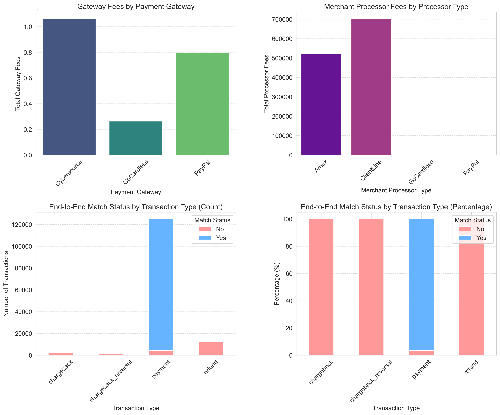

# Automated End-to-End Electronic Payment Reconciliation with Analytics

### Project Description

This project automates the end-to-end electronic payment reconciliation process by integrating data from payment gateways, merchant processors, and bank statements with Oracle/Zuora systems. The solution ensures accurate, timely matching of all transaction types—including payments, refunds, chargebacks, and chargeback reversals—while accounting for processing fees and FX variances. Advanced analytics and machine learning are used for exception management and predictive insights.
   
  - **Electronic Payment Methods:**  
  - **Credit Card**  
  - **ACH (Automated Clearing House)**  
  - **PayPal**

### Key Questions Addressed

- How can payment transactions be automatically reconciled across billing, gateway, processor, and bank records?
- What are the main sources of reconciliation failures and exceptions?
- How can machine learning predict transactions likely to fail reconciliation?
- What are the cost drivers (fees,delays,fx rate) across gateways and processors?
- How can reconciliation performance be monitored and improved over time?

### Goals

- Automate daily reconciliation of electronic payments across all data sources
- Reduce manual effort and reconciliation errors
- Enable predictive analytics for proactive exception management
- Deliver actionable insights for process optimization

---

### Data

| Dataset                | Description                                                                 | Rows    | Columns |
|------------------------|-----------------------------------------------------------------------------|---------|---------|
| billing.csv            | Payment transactions from business system                                   | 141,250 | 18      |
| gateway.csv            | Payment gateway transaction records (PayPal, Cybersource, GoCardless)       | 141,250 | 23      |
| merchant_processor.csv | Merchant processor settlements, payouts, and fees                           | 141,250 | 33      |
| bank_statement.csv     | Bank account activity for electronic payment settlements                    | 2,175   | 15      |

---

### Analysis

| Category             | Libraries Used                                                                                  |
|----------------------|------------------------------------------------------------------------------------------------|
| Data Manipulation    | pandas, numpy                                                                                  |
| Visualization        | seaborn, matplotlib, missingno                                                                 |
| Profiling/EDA        | ydata_profiling                                                                                |
| Machine Learning     | scikit-learn (RandomForestClassifier, LogisticRegression, train_test_split, metrics, encoding) |
| Feature Engineering  | pandas, scikit-learn (OneHotEncoder, ColumnTransformer)                                        |
| Widgets/Utilities    | ipywidgets, sys, warnings                                                                      |

The specifics of the analysis, including data understanding, missing data analysis, data preparation, code, visualizations, comments, observations, model comparison, and model evaluation, are available in the following Jupyter Notebook.

[Link to Jupyter Notebook](/AIML_Capstone_Automated_ePayment_Recon.ipynb)

---

### Methodology

- **CRISP-DM** (Cross-Industry Standard Process for Data Mining) framework:
    1. Business Understanding
    2. Data Understanding
    3. Feature Engineering and Data Preparation
    4. Modeling
    5. Evaluation
    6. Model Optimization
    7. Next Steps and Recommendation

---

### Table of Contents

1. **Business Understanding**  
    
2. **Data Understanding**
3. **Feature Engineering and Data Preparation**
4. **Modeling**
5. **Evaluation**
6. **Model Optimization**
7. **Next Steps and Recommendation**

---

## 1. Business Understanding

### Objective

Automate and optimize the electronic payment reconciliation process by integrating and matching transactions across multiple financial systems (billing, payment gateway, merchant processor, and bank statement). The goal is to ensure accurate, timely reconciliation, reduce manual effort, and enable predictive analytics for exception management.

### Business Problem

Manual reconciliation of electronic payments is time-consuming, error-prone, and lacks transparency. Discrepancies can arise due to processing delays, FX differences, fees, or data mismatches across systems. This leads to operational inefficiencies, delayed financial close, and increased risk of undetected exceptions.

Key challenges include:
- Matching transactions across disparate data sources with inconsistent formats and identifiers.
- Identifying and explaining reconciliation failures or exceptions.
- Quantifying the impact of fees, FX rates, and processing delays.
- Enabling proactive exception management and process improvement.

### Process Flow

The end-to-end reconciliation process involves the following steps:

1. **Data Ingestion:** Collect transaction data from billing, payment gateways, merchant processors, and bank statements.
2. **Data Standardization:** Clean and harmonize data formats, column names, and identifiers.
3. **Multi-Stage Matching:** Sequentially match transactions across systems (Billing ↔ Gateway ↔ Processor ↔ Bank).
4. **Exception Handling:** Flag unmatched or discrepant transactions for review.
5. **Analytics & Reporting:** Generate reconciliation metrics, exception reports, and business insights.
6. **Predictive Modeling:** Use machine learning to predict reconciliation outcomes and identify risk factors.

## 2. Data Understanding

This section provides an overview of the data sources used for end-to-end payment reconciliation. Each dataset represents a critical stage in the payment lifecycle, enabling comprehensive integration and analysis.

### Data Sources

| Dataset                | Description                                                                 | Download Link                |
|------------------------|-----------------------------------------------------------------------------|------------------------------|
| billing.csv            | Payment transactions from Oracle/Zuora billing system                       | [billing.csv](data/billing.csv.zip) |
| gateway.csv            | Payment gateway transaction records (PayPal, Cybersource, GoCardless)       | [gateway.csv](data/gateway.csv) |
| merchant_processor.csv | Merchant processor settlements, payouts, and fees                           | [merchant_processor.csv](data/merchant_processor.csv.zip) |
| bank_statement.csv     | Bank account activity for electronic payment settlements                    | [bank_statement.csv](data/bank_statement.csv) |

### Key Features

- **billing.csv:** Transaction date, amount, customer, payment method, gateway, processor response, FX rate, etc.
- **gateway.csv:** Gateway transaction ID, status, response, amount, currency, type, card brand, fees, net settled amount, date, reference number.
- **merchant_processor.csv:** Processor transaction ID, type, fees, settled amount, settlement date, batch, currency, order ID.
- **bank_statement.csv:** Record type, transaction date, currency, customer, amount, payment method, processor/gateway references, FX rate.

These datasets are systematically cleaned, standardized, and joined to enable multi-stage reconciliation and advanced analytics.
### Exploratory Data Analysis (EDA) Reports

Comprehensive profiling reports were generated for each dataset using `ydata_profiling` to assess data quality, distributions, missing values, and correlations. These interactive HTML reports provide detailed insights and can be accessed below:

- [Billing Data Profile Report](/EAD_billing_data_profiling_report.html)
- [Gateway Data Profile Report](/EAD_gateway_data_profiling_report.html)
- [Merchant Processor Data Profile Report](/EAD_merchant_processor_data_profiling_report.html)
- [Bank Statement Data Profile Report](/EAD_bank_statement_data_profiling_report.html)
- [End-to-End Reconciliation Data Profile Report](/EAD_end_to_end_recon_profiling_report.html)

These reports are essential for understanding the structure and nuances of each dataset prior to feature engineering and modeling.

## 3. Feature Engineering and Data Preparation

This section details the data preparation pipeline, including cleaning, transformation, and feature engineering steps for each dataset and the integrated end-to-end reconciliation dataset.

---

### 3.1 Billing Data Preparation

- **Column Renaming:** Standardized column names for consistency (e.g., `Record_Type` → `BS_Record_Type`).
- **Data Types:** Converted date columns to datetime, amounts to float.
- **Missing Values:** Imputed or flagged missing values in key fields.
- **Feature Engineering:** Extracted date parts (year, month, day, day of week), calculated FX-adjusted amounts.
- **Categorical Encoding:** Prepared for one-hot encoding of payment method, card type, gateway, etc.

---

### 3.2 Gateway Data Preparation

- **Column Selection:** Used essential columns:  
    `['GW_Transaction_ID', 'GW_name', 'GW_Transaction_Status', 'GW_Response_Code', 'GW_Response', 'GW_Transaction_Amount', 'GW_Trx_Currency', 'GW_Trx_Type', 'GW_Card_Brand', 'GW_fees', 'GW_Net_Settled_Amt', 'GW_Trx_Date', 'GW_Ref_Number']`
- **Column Renaming:** Unified naming conventions (e.g., `GW_Transaction_ID`).
- **Data Types:** Converted transaction dates, amounts, and fees to appropriate types.
- **Missing Values:** Imputed or flagged missing gateway responses and amounts.
- **Feature Engineering:** Extracted date parts, calculated net settled amounts, and flagged exceptions.

---

### 3.3 Merchant Processor Data Preparation

- **Column Selection:** Used essential columns:  
    `['MP_Trx_ID', 'MP_Processor_Type', 'MP_Trx_Type', 'MP_Processor_Fee', 'MP_Settled_Amount', 'MP_Settlement_Date', 'MP_Settlement_Batch', 'MP_Trx_Currency', 'MP_Order_ID']`
- **Column Renaming:** Standardized processor and transaction fields.
- **Data Types:** Ensured correct types for dates, amounts, and fees.
- **Missing Values:** Imputed or flagged missing settlement data.
- **Feature Engineering:** Extracted date parts, calculated total fees, and batch-level aggregations.

---

### 3.4 Bank Statement Data Preparation

- **Column Renaming:** Standardized to `BS_` prefix for all columns.
- **Data Types:** Converted transaction dates, credits, and debits to numeric types.
- **Missing Values:** Imputed or flagged missing transaction references and amounts.
- **Feature Engineering:** Extracted date parts, calculated net movement, and flagged unmatched deposits.

---

### 3.5 End-to-End Reconciliation Dataset

- **Data Integration:**  
    - Merged billing, gateway, merchant processor, and bank statement datasets using transaction IDs, reference numbers, and dates.
    - Multi-stage matching: Billing ↔ Gateway ↔ Processor ↔ Bank.
- **Feature Engineering:**  
    - Created match flags (`BS_GW_Match`, `PG_MP_Match`, `end_to_end_recon_match`).
    - Engineered new date features for all transaction stages.
    - Calculated reconciliation status, exception types, and aggregated fees.
- **Handling Missing Data:**  
    - Imputed missing values for numerical columns using median or mean.
    - Encoded categorical variables using one-hot encoding.
- **Final Dataset:**  
    - Assembled a unified dataframe with all engineered features, ready for modeling and analytics.
---

 ### 3.6 Key Visualizations

  #### 1. End-to-End Reconciliation Match Status
  
  - **Bar Plot:**  
      Visualize the count of transactions that are fully reconciled (`end_to_end_recon_match = Yes`) versus those that are not (`No`).
  
  #### 2. Intermediate Match Flags (Billing <--> Gateway Match Distribution)
  
  - **Stacked Bar Plot:**  
      Show the distribution of intermediate match flags (`BS_GW_Match`, `PG_MP_Match`) to understand at which stage mismatches occur.
  
  #### 3. Unmatched Records Breakdown (Unmatched Records by Currency)
  
  - **Pie Chart or Bar Plot:**  
      Analyze the proportion of unmatched records by key attributes such as `BS_Currency`, `BS_Payment_Method_Type`, or `MP_Processor_Type` to identify patterns in reconciliation failures.
  
  #### 4. Time Series Analysis (Reconciliation Status Over Time)
  
  - **Line or Bar Plot:**  
      Plot the number of reconciled and unreconciled transactions over time (e.g., by `BS_Transaction_Date` or `MP_Settlement_Date`) to detect trends or anomalies.
  
  #### 5. Amount Analysis (Transaction Amounts by Reconciliation Status)
  
  - **Boxplot or Histogram:**  
      Compare the distribution of transaction amounts for matched vs. unmatched records to see if certain value ranges are more prone to reconciliation issues.
---
 

---

#### 3.6.1 Gateway and Merchant Processor Fee Analysis with Transaction Type Reconciliation

This visualization section provides a comprehensive analysis of fee structures and reconciliation performance across different payment channels and transaction types.

#### 1. Gateway Fees by Payment Gateway
- **Bar chart** displaying total gateway fees collected by each payment gateway (PayPal, Cybersource, GoCardless)
- Helps identify which gateways generate the highest fee revenue and compare fee structures across providers
- Essential for cost analysis and gateway performance evaluation

#### 2. Merchant Processor Fees by Processor Type
- **Bar chart** showing total processor fees charged by different merchant processor types (Amex, ClientLine, GoCardless, PayPal)
- Enables comparison of processing costs across different payment processors
- Critical for understanding the true cost of payment processing and identifying optimization opportunities

#### 3. End-to-End Match Status by Transaction Type (Count)
- **Stacked bar chart** displaying the absolute number of successfully reconciled vs. unreconciled transactions for each transaction type (payment, refund, chargeback, chargeback_reversal)
- Shows which transaction types are most problematic for reconciliation
- Helps prioritize process improvements based on volume of unmatched transactions

#### 4. End-to-End Match Status by Transaction Type (Percentage)
- **Stacked bar chart** showing the percentage breakdown of reconciliation success rates by transaction type
- Provides a normalized view of reconciliation performance across different transaction categories
- Reveals that payments have a ~97% reconciliation success rate, while other transaction types (chargebacks, refunds, chargeback reversals) show 0% reconciliation success

**Key Insights:**
- Payment transactions demonstrate excellent reconciliation performance
- Non-payment transaction types require process improvements
- Fee analysis helps optimize payment gateway and processor selection
- Visual comparison enables data-driven decisions for payment infrastructure

---
   **End-to-End Match Status by Transaction Type (Percentage):**  
        

#### 3.6.2 Billing Data Analysis Visualizations

This section provides comprehensive visualizations of the billing transaction data to understand payment patterns, distribution across different dimensions, and business insights.

**1. Total Amount by Currency (Bar Chart)**
- Displays transaction volumes in millions across different currencies (USD, EUR, GBP, CAD, AUD)
- Helps identify primary markets and currency exposure
- Essential for understanding geographical distribution of business

**2. Total Amount by Payment Method Type (Pie Chart)**
- Shows the distribution of payment amounts across different payment methods (ACH, Credit Card, PayPal)
- Provides insights into customer payment preferences
- Critical for understanding payment channel performance and fees

**3. Total Amount by Payment Gateway (Pie Chart)**
- Illustrates the distribution of transaction volumes across payment gateways (Cybersource, GoCardless, PayPal)
- Helps evaluate gateway performance and market share
- Important for strategic decisions on gateway partnerships

**4. Total Amount by Transaction Month (Bar Chart)**
- Shows monthly transaction volumes over time (January 2025 - March 2025)
- Reveals seasonal patterns and business growth trends
- Enables forecasting and capacity planning

**Business Insights:**
- Payment method distribution shows balanced usage across ACH, Credit Card, and PayPal channels
- Gateway distribution indicates roughly equal processing volumes across major providers
- Monthly trends can inform business planning and resource allocation
- Currency analysis supports international expansion strategies

These visualizations support data-driven decision making for payment processing optimization, fee management, and business development initiatives.

  - **Amounts by Month:**  
    

  ---

**Summary:**  
The data preparation pipeline ensures all datasets are cleaned, standardized, and feature-rich, enabling robust reconciliation, analytics, and machine learning. Each step is reproducible and documented for transparency and auditability.

## 4. Modeling

### Overview

A Random Forest classifier was developed to predict the success or failure of end-to-end payment reconciliation. The model leverages engineered features from all data sources, including transaction amounts, dates, payment methods, gateway/processor details, and match flags. The dataset was split into training and test sets to evaluate model generalizability.

#### Model Summary

- **Algorithm:** Random Forest Classifier
- **Key Features:** Transaction details, categorical encodings, engineered date features, match flags
- **Performance Metrics:**  
    - **Accuracy:** 0.97  
    - **Precision:** 0.97  
    - **Recall:** 1.00  
    - **F1-Score:** 0.98  
    - **ROC-AUC:** 1.00  
- **Training Time:** ~0.23 seconds  
- **Test Time:** ~0.03 seconds  

The model demonstrates high predictive power, especially in identifying successful reconciliations (Recall = 1.00), with strong overall precision and F1-score. The ROC-AUC of 1.00 indicates excellent discrimination between successful and failed reconciliations.

---

### Model Performance Visualization

The following figure summarizes the Random Forest model's performance using key metrics and visualizations:

- **Confusion Matrix:** Shows the count of true positives, true negatives, false positives, and false negatives.
- **ROC Curve:** Illustrates the trade-off between true positive rate and false positive rate.
- **Feature Importance:** Highlights the top features contributing to model predictions.
- **Prediction Probability Distribution:** Displays the separation between successful and failed reconciliation probabilities.

---

**Conclusion:**  
The Random Forest model provides robust and interpretable predictions for payment reconciliation outcomes, enabling proactive exception management and process optimization. Further model tuning and validation can be performed as needed.

## 5. Evaluation

### Model Evaluation Metrics

The Random Forest model was evaluated using standard classification metrics on the test set:

- **Accuracy:** 0.97  
- **Precision:** 0.97  
- **Recall:** 1.00  
- **F1-Score:** 0.98  
- **ROC-AUC:** 1.00  

These metrics indicate the model is highly effective at identifying both successful and failed reconciliations, with perfect recall and ROC-AUC, and very high precision and F1-score.

#### Confusion Matrix

The confusion matrix below summarizes the model's predictions:

|                | Predicted: No | Predicted: Yes |
|----------------|:-------------:|:--------------:|
| **Actual: No** |      TN       |      FP        |
| **Actual: Yes**|      FN       |      TP        |

- **TP (True Positives):** Correctly predicted successful reconciliations
- **TN (True Negatives):** Correctly predicted failed reconciliations
- **FP (False Positives):** Incorrectly predicted as successful
- **FN (False Negatives):** Incorrectly predicted as failed

#### ROC Curve

The ROC curve demonstrates the model's ability to distinguish between classes, with an AUC of 1.00 indicating perfect separation.

#### Feature Importance

The top features driving model predictions include:

| Feature                  | Importance |
|--------------------------|------------|
| Bank_Credits             | 0.062      |
| Bank_Deposit_Date_Year   | 0.042      |
| MP_Processor_Type        | 0.039      |
| BS_GW_Match_No           | 0.036      |
| MP_Trx_Type              | 0.032      |

These features highlight the significance of bank credits, settlement dates, processor types, and match flags in reconciliation outcomes.

---

**Summary:**  
The evaluation confirms the Random Forest model's robustness and reliability for predicting reconciliation outcomes, supporting automated exception management and process improvement. Further validation and monitoring are recommended for production deployment.

## 6. Next Steps and Recommendations

### Next Steps
- **Explore Alternative Models:** Evaluate additional algorithms such as Decision Tree, Logistic Regression, K-Nearest Neighbors (KNN), and Support Vector Machine (SVM), as well as ensemble techniques (e.g., Gradient Boosting, AdaBoost, XGBoost). Test various hyperparameters for each model to identify the optimal approach for reconciliation prediction.
- **Expand Data Sources:** Integrate additional payment gateways, processors, and bank accounts to increase reconciliation coverage.
- **Automate Exception Handling:** Develop automated workflows for exception review, resolution, and escalation.
- **Model Monitoring:** Implement ongoing monitoring of model performance and retrain as new data becomes available.
- **User Interface:** Build dashboards for real-time reconciliation status, exception tracking, and analytics.
- **Audit Trail:** Enhance logging and auditability for compliance and transparency.

### Recommendations

- **Continuous Data Quality Checks:** Regularly validate and clean incoming data to minimize reconciliation errors.
- **Process Optimization:** Analyze exception patterns to identify root causes and optimize upstream processes.
- **Cost Analysis:** Use analytics to negotiate better rates with processors and optimize payment routing.
- **Scalability:** Design the solution for scalability to handle increasing transaction volumes and new business lines.
- **Stakeholder Training:** Provide training and documentation for finance and operations teams to maximize adoption and value.
